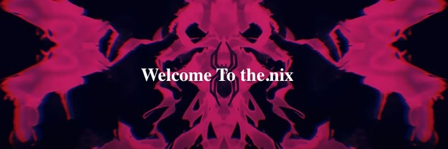

# Namaste! I'm Nishal ✨

Im a **Full Stack Developer** who loves to bring ideas to life on a screen. I am passionate about Machine Learning and Artificial Intelligence. I am excited about designing and developing websites and web applications that are **fast**, **responsive**, and **accessible** to everyone.

